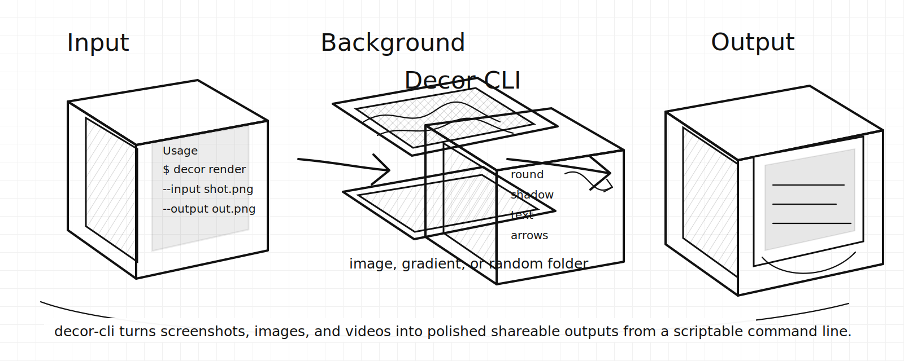
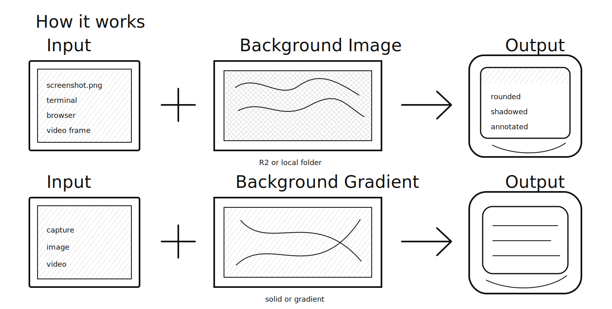
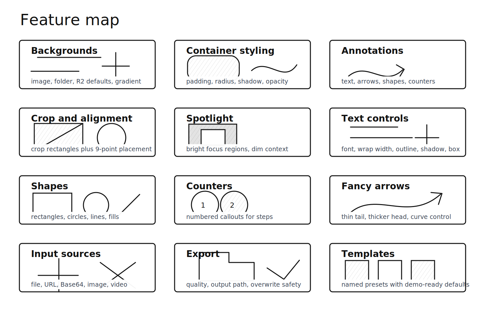
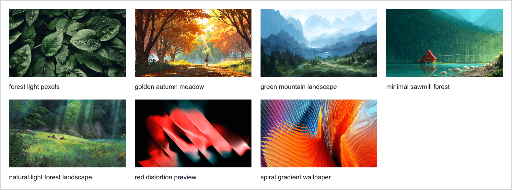

# decor-cli

[](https://github.com/mrgoonie/decor-cli/releases)
[](https://www.npmjs.com/package/decor-cli)



`decor-cli` decorates images and videos from a CLI or MCP server. It adds backgrounds, gradients, rounded containers, shadows, padding, crop, alignment, text, arrows, shapes, counters, spotlight, and template presets without distorting the original media ratio.

## How It Works



## Features



- Backgrounds: solid colors, gradients, specific image files, random folders, and hosted default backgrounds.
- Container styling: padding, rounded corners, nine-point alignment, opacity, blur, and drop shadow controls.
- Input sources: local files, web URLs, Base64 payloads, images, and videos.
- Crop and composition: crop rectangles, preserve original ratio, and export without distortion.
- Text: font family, size, color, coordinates, wrap width, outline, shadow, and rounded text boxes.
- Annotations: curved arrows, rectangles, circles, lines, transparent fills, and numbered counters.
- Spotlight: brighten a selected region while dimming surrounding context.
- Templates: reusable named presets for common screenshot and visual styles.
- Agent-ready surfaces: CLI, MCP server, and companion agent skill.

## Install

```bash
npm install -g decor-cli
decor install-backgrounds
```

Video rendering uses system `ffmpeg` and `ffprobe`. Install them with your OS package manager or set `DECOR_FFMPEG_PATH` and `DECOR_FFPROBE_PATH`.

## Quick Start

```bash
decor render --input screenshot.png --output output.png --template clean-gradient --text "Release notes" --overwrite
decor render --input screenshot.png --output output.png --background-folder ~/.decor-cli/backgrounds --padding 104 --radius 38 --overwrite
decor render --input demo.mp4 --output demo-decorated.mp4 --padding 96 --radius 36 --overwrite
decor install-backgrounds --dir ./backgrounds
decor list-templates
decor doctor --json
```

URL and Base64 inputs are supported:

```bash
decor render --input-url https://example.com/image.png --output output.png
decor render --input-base64 "$DATA_URI" --output output.png
```

Private, loopback, link-local, and metadata URL targets are blocked by default. Use `--allow-private-network` only for trusted local fixtures.

## Background Gallery

Run `decor install-backgrounds` on a fresh machine to download this hosted background pack into `~/.decor-cli/backgrounds`.



## Config

Most advanced features are configured through JSON:

```json
{
  "template": "clean-gradient",
  "input": { "type": "path", "path": "screenshot.png" },
  "output": { "path": "output.png", "quality": 92, "overwrite": true },
  "container": { "padding": 96, "radius": 36, "alignment": "center" },
  "annotations": [
    { "type": "text", "text": "Step 1", "x": 80, "y": 90, "fontSize": 44, "shadow": true },
    { "type": "counter", "value": 1, "x": 110, "y": 160, "size": 42 },
    { "type": "arrow", "from": { "x": 120, "y": 180 }, "to": { "x": 260, "y": 220 } }
  ]
}
```

Run it:

```bash
decor render --config decor.config.json --output output.png
```

## MCP

```bash
decor-mcp --transport stdio
DECOR_MCP_TOKEN=example-token decor-mcp --transport http --port 8080
```

MCP tools: `render_decor`, `preview_decor`, `validate_decor`, `list_templates`, `doctor`, and `config_resolve`.

## Release

Conventional commits drive releases with semantic-release:

- `main` -> stable GitHub release and npm `latest`
- `dev` -> beta prerelease and npm `beta`

Publish jobs are separated from PR CI and should be protected with the `release` environment. Set the repository `NPM_TOKEN` secret before the first live publish.

## Default Backgrounds

`decor install-backgrounds` downloads the hosted default background pack from Cloudflare R2 into `~/.decor-cli/backgrounds`. The installer verifies every file by byte length and SHA-256 before replacing local files. Use `--dir <path>` to install elsewhere and `--force` to redownload files that already match the manifest.
