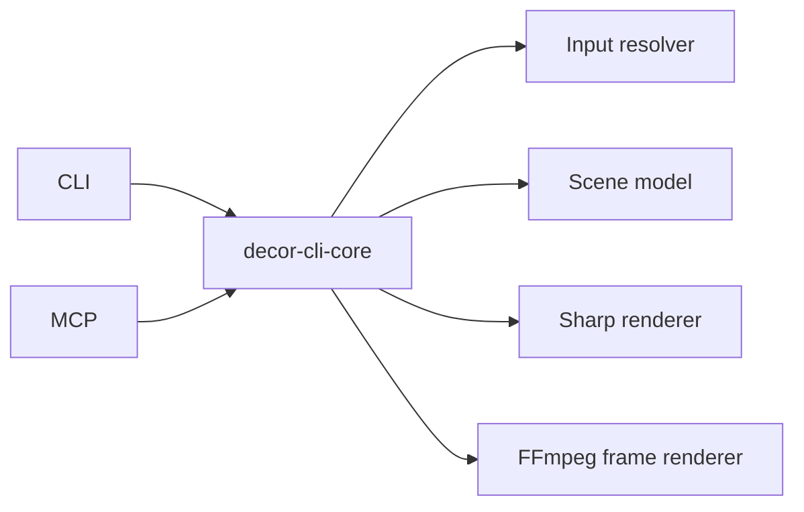

# System Architecture

`decor-cli` uses one shared core and two thin adapters.

Core owns schemas, template resolution, input safety, geometry, SVG overlays, and rendering. CLI and MCP translate user input into core requests and format results.
